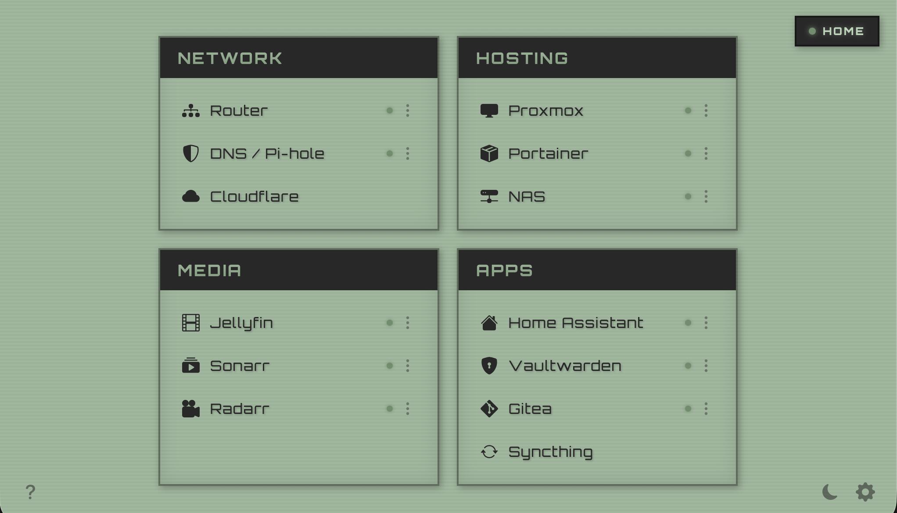

# CRTL

Phosphor / CRT-styled homelab dashboard. Ships as one self-contained
`CRTL.html` - fonts and curated icons are baked in, so it has no runtime
dependencies and works fully offline. Open it in a browser and you're done.

     

  

## What it does

- **Groups of services** in a card layout. Each row has an icon, a name, and
  one or more links.
- **Click** an entry -> opens its primary URL in a new tab.
- **Long-press** an entry with multiple links -> a horizontal button strip
  slides in from the right with all of them labeled.
- **Auto Home / Away detection.** At load and every 60 seconds the page
  probes a configurable list of internal endpoints. If any responds, you're
  Home; otherwise Away.
- **Away mode** reorders each entry's links so non-internal URLs come first,
  and dims entries that have no non-internal URL.
- **Optional per-service health dots** beside each name (green = up, amber =
  down). Toggle it per entry in the editor.
- **A pill in the top-right** shows the current location state and lets you
  flip it manually.

No tracking, no analytics, no telemetry. On a normal load the only network
calls are the Home/Away and health probes you configure - fonts and curated
icons are bundled, so nothing is fetched from a CDN. Two **opt-in** features do
reach the network, and the UI says so:

- **Brand icons** (`svg:...`) and any non-curated Bootstrap icon are fetched once
  from a public CDN (api.iconify.design / unpkg) when you save the entry, then
  embedded into your config.
- **Encrypted gist sync** talks to `api.github.com` (AES-encrypted payload).

## Two versions

CRTL comes in two forms, built from the same source:

- **Local file** (`CRTL.html`) - the downloadable single file. Open it via
  `file://` or serve it over plain `http://`. **Full features**, including
  automatic Home / Away detection and per-service health dots. Best on desktop.
- **Hosted web build** - the same app served from a URL, for devices that can't
  open a local file. **This is the only option on iPhone / iPad**, where Safari
  can't run a downloaded `.html`. Android can use either (the local file works
  but is fiddly to open; the hosted build is easier).

The trade-off on the hosted build: it's served over `https://`, and browsers
block an `https://` page from probing your `http://` LAN (mixed content). So by
default the hosted build turns **Home / Away** into a manual toggle and shows
health dots only for `https` services. You can restore automatic detection with a
small beacon - see
[Home and Away on the hosted version](#home-and-away-on-the-hosted-version).

The bottom-right **gear -> Help** shows which build you're running and its
version.

## Requirements

Any modern browser - Chrome, Firefox, Safari, or Edge. Nothing to install; the
local build runs straight from `file://`. Encrypted sync uses the Web Crypto API,
which needs a secure context - the local file (`file://`) and any `https://` page
both qualify.

## Setup

1. **Desktop / Android:** download `CRTL.html` from the
   [latest release](https://github.com/BrainInBlack/CRTL/releases/latest) and
   open it via `file://`, or set it as your homepage / new-tab page.
   **iPhone / iPad:** a downloaded file won't open in Safari - use the hosted web
   build instead.
2. Click the **gear** (bottom-right) -> **Edit mode** to add groups and entries,
   then **Global options** to set your Home-detection probes (URLs reachable
   only from your home network).
3. Config is saved in the browser; enable gist sync to share it across machines.

Your config lives in `localStorage` (and the gist, if you turn on sync). The
built-in defaults are only a first-run seed.

## Icons

Open an entry in the editor to set its icon. Two sets are available:

- **Bootstrap Icons** - pick one from the built-in picker, or type `bi:name`
  (browse names at [icons.getbootstrap.com](https://icons.getbootstrap.com/)).
- **Brand / logo icons** - type `svg:name` for a
  [Simple Icons](https://simpleicons.org/) glyph, e.g. `svg:proxmox` or
  `svg:jellyfin`.

The common Bootstrap icons are baked into the file and render offline. Any other
icon - a brand glyph, or a Bootstrap icon outside the curated set - is fetched
once from a public CDN when you save the entry, then embedded into your config so
it keeps working offline afterwards. This is one of the two features that reach
the network, and only on save.

## Sync

By default your config lives only in this browser. Optional **encrypted
GitHub-gist sync** shares it across machines. The gist payload is AES-encrypted in
your browser before upload, so GitHub only ever stores ciphertext - only your
machines hold the key.

To turn it on (**gear -> Global options -> Encrypted gist sync**):

1. Create a GitHub [personal access token](https://github.com/settings/tokens)
   (classic) with the **`gist`** scope, and paste it into **GitHub token**.
2. Click **Generate key**. Leave **Gist ID** blank to create a fresh private gist
   (or paste an existing gist id to join it).
3. Flip the sync toggle to **On** - CRTL creates or loads the gist and keeps it in
   sync as you edit.

To add another machine, **Copy** the **Setup blob** on the first machine and paste
it into the **Setup blob** box on the second, then click **Import**. The blob
carries the token, gist id, and key; the second machine imports the gist and stays
in sync.

A couple of things to know:

- **Last-write-wins.** Config versions are wall-clock timestamps, so editing on
  two machines at once can lose the older edit, and a fast clock tends to win.
  Fine for one active machine at a time; keep clocks roughly in sync.
- **The token has `gist` scope** - it can read and write *all* your gists, not
  just this one - and it's stored locally in plaintext next to the encryption key
  (the setup blob holds both too). Only enable sync on machines you trust.

## Home and Away on the hosted version

On the hosted (`https://`) build, automatic Home / Away detection is off, because
browsers won't let an `https://` page probe your `http://` LAN. To bring it back,
give the page **one** endpoint it *can* reach over `https` - a "beacon" that only
resolves on your home network. Home, the probe succeeds (**Home**); away, it
fails (**Away**).

You need a hostname served over trusted `https` that only routes on your LAN. The
cleanest setup:

1. Pick a hostname, e.g. `home-ping.yourdomain.com`.
2. Point its **public DNS `A` record at a private LAN IP** (e.g. `192.168.1.2`).
   Off your network that address is unroutable, so the probe fails - exactly the
   "Away" signal you want. No split-horizon DNS needed.
3. Issue a **real certificate** for it with a **DNS-01** challenge (Let's
   Encrypt), so Safari trusts it out of the box with no per-device profile. A
   `*.yourdomain.com` wildcard covers it.
4. Front any always-on LAN service with it. In **Nginx Proxy Manager**: add a
   **Proxy Host** for `home-ping.yourdomain.com`, forward it to something that is
   always up (the NPM admin page, your router, a NAS), then under **SSL**
   request/assign the DNS-01 wildcard certificate and enable **Force SSL**.
5. In CRTL, open **gear -> Global options** and add
   `https://home-ping.yourdomain.com` to your **Home probes**.

That's it - the hosted build now auto-detects. Your existing `http://` probes can
stay in the list; the hosted build simply ignores them (it can't reach them over
`https`) while the local file still uses them. Per-service `http` health dots
remain hidden on the hosted build - the beacon only drives Home / Away.

## How "internal" is determined

For Away-mode link reordering and dimming, a URL is considered internal if
its hostname:

- ends in `.home` or `.local`
- is in an RFC1918 range (`10.x`, `192.168.x`, `172.16-31.x`)

Loopback (`127.x` / `localhost`) is treated as always-reachable, not
internal.

## Notes

- The probe mechanism is `fetch(url, { mode: 'no-cors' })`. The response is
  opaque, but the fetch resolves on any HTTP response and rejects on
  network-layer failure. That's enough to tell whether a host is reachable.
- Cloudflare-fronted services may set
  `Cross-Origin-Resource-Policy: same-origin`, which blocks opaque fetches
  from `file://` and makes them probe as down. Turn off that entry's health
  check if it bothers you.
- Self-signed certificates work fine **as long as the browser trusts them**
  (e.g. via your own CA installed on the device). A cert the browser would
  warn about will probe as down.
- **Serve via `file://`** (or plain `http://`). The probes are `http://` requests
  to LAN IPs; on a page served over `https://` browsers block them as mixed
  content, so everything reads as down / Away.

## Contributing

Bug reports and PRs welcome. See [CONTRIBUTING.md](.github/CONTRIBUTING.md) for
building from source, and [docs/ARCHITECTURE.md](docs/ARCHITECTURE.md) for how it
all fits together. Found a security issue? See the
[security policy](.github/SECURITY.md) - please report it privately, not as a
public issue.

## License

[PolyForm Noncommercial 1.0.0](LICENSE) (c) BrainInBlack - free for noncommercial use.
